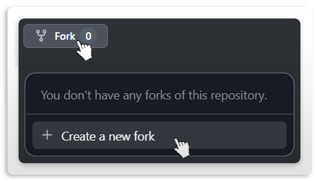

# Contributing to gitagger

Firstly, thanks for picking this up! The process is intended to be short and easy to understand, so please make sure to follow the guidelines below. Once your changes are finalized, submit your PR and it will be reviewed!

## Getting Started

### 1. **Clone and branch.** 

Fork the project from [GitHub](https://github.com/CHE3MZ/gitagger/fork),



   ```sh
   git clone https://github.com/YOUR_USERNAME/gitagger.git
   cd gitagger
   git switch -c feat-short-description
   ```
   Name the branch after the work (`feat-rm-alias`, `fix-doctor-offline`). It makes the commit list readable later.

### 2. **Make your change.** 

Keep it scoped — one thing per branch. Match the existing code style (strict flags, explicit errors, no magic), and add tests in `tests/` for anything new (if possible). All tests use throwaway temp repos and the git on your `PATH`; they never touch the repo's own `.git`.

### 3. **Check locally first.** 

The `scripts/` folder is the local gate — run these before you push:
   ```sh
   sh scripts/test.sh              # vet + full test suite (~1 min)
   sh scripts/ops/go-bugcheck.sh   # golangci-lint, govulncheck, staticcheck, errcheck, vet, test
   sh scripts/ops/go-seccheck.sh   # gosec
   ```
   Plus the build scripts to prove it compiles everywhere:
   ```sh
   sh scripts/build-linux.sh
   sh scripts/build-macos.sh
   scripts\build-windows.bat
   ```
   > [!NOTE]
   > Two notes: `gopls` gets skipped by `go-bugcheck.sh` on some shells (plain `sh` has no `mapfile`) — CI runs it for real, so don't sweat that one locally. And never cut tags or releases yourself; the maintainer handles all of that.

### 4. **Push and watch CI go green.** 

Push the branch, then make sure **every** workflow is green *before* opening the PR:
   ```sh
   git push origin feat-short-description
   gh run watch
   ```
   That's CI (build + vet + test, ops lint, actionlint), the action self-test, the cross-platform Build matrix, and the Docker job etc. If something's red, fix it on the branch and push again, if the errors were not caused by your changes make sure to document it in your PR description!

### 5. **Open the PR.** 

Use a conventional title — same style as the commit history:
   `feat:`, `fix:`, `tweak:`, `chore:`, `docs:`, `test:`, `refactor:` — short and specific, e.g. `feat: rm shorthand for remove`, not `feat: updates`.
   ```sh
   gh pr create --title "feat: rm shorthand for remove" --body "What it does and why."
   ```
   A maintainer will review it. Expect comments, don't take them personally — small focused PRs get merged fast, big sprawling ones get asked to split.

## Ground rules

- Green CI is the entry ticket, not a suggestion.
- Conventional commit messages (`git log --oneline` shows the style).
- No tags, no releases, no force-pushes to `master`.
- One concern per PR. If you spot something else broken along the way, branch it separately.


