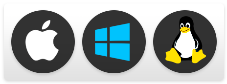
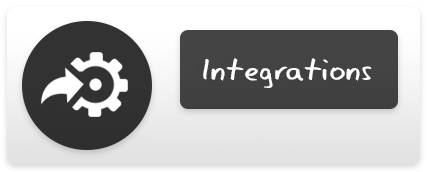
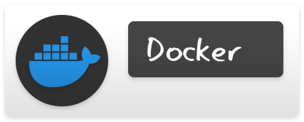
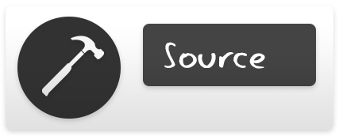
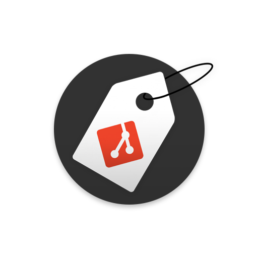

# Gitagger

[](https://github.com/CHE3MZ/gitagger/actions/workflows/ci.yml)
[](https://github.com/CHE3MZ/gitagger/actions/workflows/action-test.yml)
[](https://github.com/CHE3MZ/gitagger/actions/workflows/gitagger.yml)
[](https://github.com/CHE3MZ/gitagger/releases/latest)
[](https://github.com/CHE3MZ/gitagger/actions/workflows/ghcr-docker.yml)

### Gitagger makes tag creation for git projects *ridiculously* <u> simple and easy! </u>

Just [Install](#installation) it and run `gitagger` and it will integrate with your existing tag format or initialize one for you.


### Full documentation [**here!**](https://che3mz.github.io/gitagger/)

## Features

### ➙ Cross Platform


Gitagger is available on Windows, MacOS and Linux!

### ➙ Hooks


You can make gitagger run basic hooks via the .gitagger.yml file! you can check out this projects own config and usage of hooks [here!](.gitagger.yml)

### ➙ Integrations


Gitagger has native integrations for GitHub Actions, Docker and Jenkins!

## Installation

### ➙ Install with Go 


Requires [Go 1.26](https://go.dev/dl/) or newer:

```sh
go install github.com/CHE3MZ/gitagger/cmd/gitagger@latest
```

### ➙ Prebuilt binaries


You can also grab a ready-made binary from the [releases page](https://github.com/CHE3MZ/gitagger/releases) (Linux, macOS, Windows).

### ➙ GitHub Actions


```yaml
- uses: CHE3MZ/gitagger@v1
```

[](https://github.com/marketplace/actions/gitagger)

> [!TIP]
> Full default template [**here!**](docs/readme/templates/github-actions.yml)

### ➙ Docker



```sh
docker pull ghcr.io/che3mz/gitagger:latest
```

[](https://github.com/che3mz/gitagger/pkgs/container/gitagger/)

### ➙ Compile from source



#### Requires [Go 1.26](https://go.dev/dl/) or newer:

```sh
git clone https://github.com/CHE3MZ/gitagger.git
cd gitagger
go build -o gitagger ./cmd/gitagger
```

#### Building the Container Image:

```sh
docker build -t gitagger .
docker run --rm -v "$PWD:/repo" -w /repo gitagger [args]
```

## Usage

```sh
gitagger                 # next patch tag, pushed if it can be
gitagger minor           # v1.2.3 -> v1.3.0
gitagger major --pre rc  # v1.2.3 -> v2.0.0-rc
gitagger --dry-run       # peek first, change nothing
gitagger --help          # everything else
```

Want the same settings every time? Run `gitagger init` once, 
tweak `.gitagger.yml`, then forget about flags.
running `gitagger` without any arguments will use your new config file.

Full docs are coming later — for now, `gitagger help <command>` tells you what each command does.

## Development

#### Contributing
If you'd like to contribute to the project you can check out the contribution guide [**here!**](CONTRIBUTING.md)

#### TODO
The TODO tasks for this project are defined in the TODO.md file [**here!**](TODO.md)

#### State
Gitagger is still pretty early in development and not super polished, but it'll get better with time.

## License

Gitagger is Licensed under the **[Apache 2.0 License](LICENSE).**

