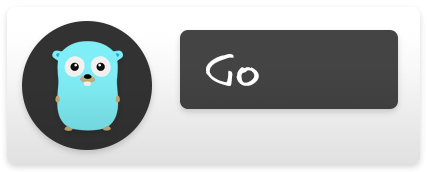

# Installation

Pick whichever fits. They all give you the same `gitagger` binary.

## Go



```sh
go install github.com/CHE3MZ/gitagger/cmd/gitagger@latest
```

Requires Go 1.26 or newer.

## Prebuilt binaries


Grab one from the [releases page](https://github.com/CHE3MZ/gitagger/releases) — Linux, macOS, and Windows, amd64 and arm64.

## From source


```sh
git clone https://github.com/CHE3MZ/gitagger.git
cd gitagger
go build -o gitagger ./cmd/gitagger
```

Requires Go 1.26 or newer.

## Docker


No published image yet — build it yourself (any OCI runtime: docker, podman, nerdctl…):

```sh
docker build -t gitagger .
docker run --rm -v "$PWD:/repo" -w /repo gitagger [args]
```

Match host file ownership with `--user "$(id -u):$(id -g)"`. The mounted directory must be readable by the container user.

## GitHub Action


```yaml
- uses: CHE3MZ/gitagger@v1
```

See the [GitHub Action guide](../automation/github-action.md) for inputs (`args`, `version`, `working-directory`) and details.

## Next step

[Cut your first tag](first-tag.md).
