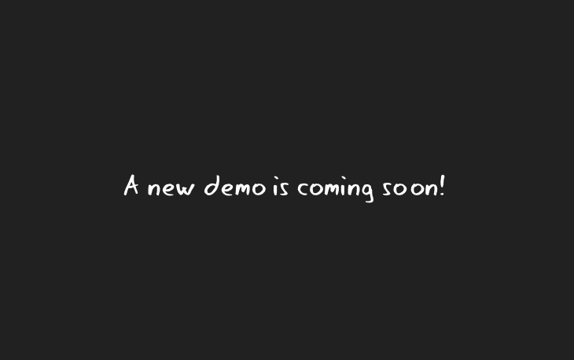

# Gitagger

**Automate git tags without the headache.** Run `gitagger` and it figures out your tag format, creates the next tag, and pushes it — or sets one up for you if you have none yet.

```sh
gitagger                 # next patch tag, pushed if it can be
gitagger minor           # v1.2.3 -> v1.3.0
gitagger major --pre rc  # v1.2.3 -> v2.0.0-rc
gitagger --dry-run       # peek first, change nothing
```

## Why gitagger?

- **Follows your convention.** Triple (`v1.2.3`), double (`v1.2`), single (`v7`), date (`v2026.10.04`), even `master-<sha>` styles — detected from your history by majority vote. No flags needed for the common case.
- **Safe by default.** Refuses to double-tag HEAD, checks the remote for collisions before pushing (with `doctor`), stays graceful offline, never force-pushes unless you say `-f`.
- **Hooks included.** Run shell commands on `start`, `success`, `failure`, and `finish` — releases, notifications, whatever your flow needs.
- **One binary, everywhere.** Linux, macOS, Windows, Docker, and a GitHub Actions. No runtime, no dependencies.

## Start here

- New? [Install gitagger](getting-started/installation.md), then [cut your first tag](getting-started/first-tag.md).
- In a hurry? [Commands](usage/commands.md) is the full CLI reference.
- Automating? [GitHub Action](automation/github-action.md), [generated workflows](automation/workflows.md), or [Docker](automation/docker.md).
- Something broken? [FAQ & troubleshooting](help/faq.md).



## License

You can check out the licensing for the project [**here!**](legal\LICENSE.md)
